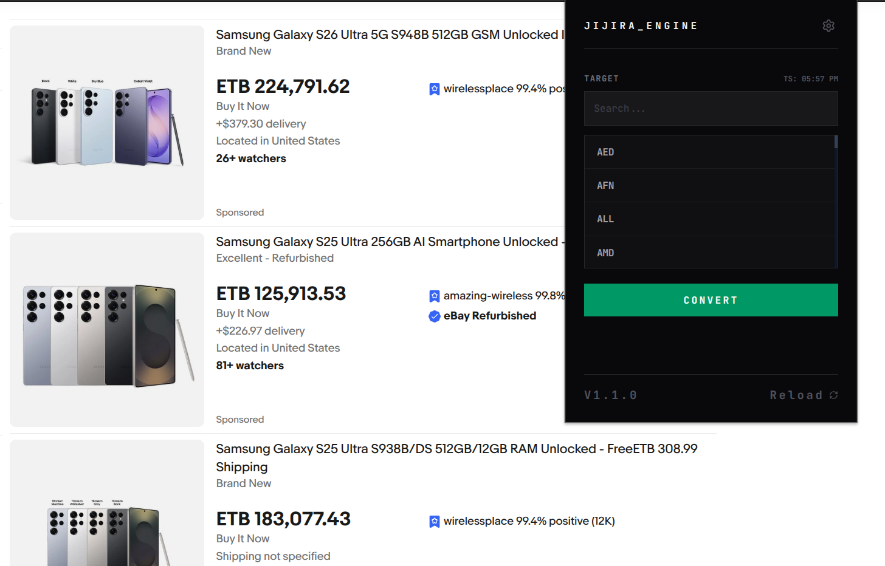
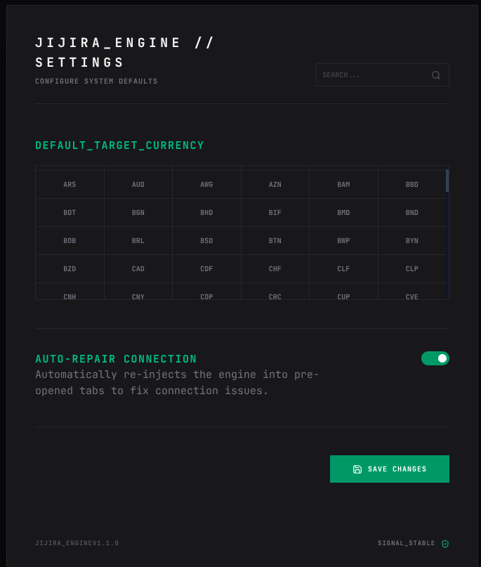

# JIJIRA

> A currency conversion engine that lives in your browser. Built for people tired of alt-tabbing to a converter every time they shop online.



---

## What it does

Jijira scans the page you're on, finds all the prices, and converts them to whatever currency you want, in place, without touching the layout. It works on most sites out of the box, with deeper integration for some popular e-commerce platforms where the price DOM gets more complicated.

It's not a simple find-and-replace. It tracks the original values so you can convert multiple times without accumulating rounding errors, and it recovers automatically if the extension loses its connection to the tab (which happens more than you'd think after tab sleep or script updates).

---

## Screenshots

**Popup**



**Settings Page**


---

## Features

- **E-commerce adapters:** dedicated handlers for Amazon and Alibaba that target price components individually (whole numbers, decimals, symbols) so the site layout stays intact
- **TreeWalker DOM scanning:** non-blocking traversal that skips scripts, styles, and interactive elements so it doesn't break anything on the page
- **Original value preservation:** converted elements are tagged with `data-jijira-original` so the source data is never lost across multiple conversions
- **Auto-repair:** detects broken extension-to-tab connections and re-injects the engine automatically
- **Persistent settings:** default currency and preferences survive browser restarts via `chrome.storage`

---

## Just want to use it?

Grab the latest zip from the [Releases page](https://github.com/Senasphy/jijira/releases), extract it, and load the folder into Chrome via Load unpacked. No Node, no build step.

---

## Installation

> For developers who want to run it locally or contribute.

**Requirements:** Node.js 20+

```bash
git clone https://github.com/yourusername/jijira-engine
cd jijira-engine
npm install
npm run build
```

Then go to `chrome://extensions`, enable **Developer mode**, click **Load unpacked**, and select the `dist/` folder.

---

## How to use it

1. Click the Jijira icon in your toolbar
2. Search for the currency you want to convert to (e.g. ETB, EUR, JPY)
3. Hit **CONVERT** and the engine scans the page and shows you how many values it updated
4. To change your default currency, open **Settings** from the popup

---

## Tech stack

- React 19
- Tailwind CSS
- Lucide React
- Vite
- Open Exchange Rates API (USD base)

---

## License

MIT. Do whatever you want with it, just keep the credit.
